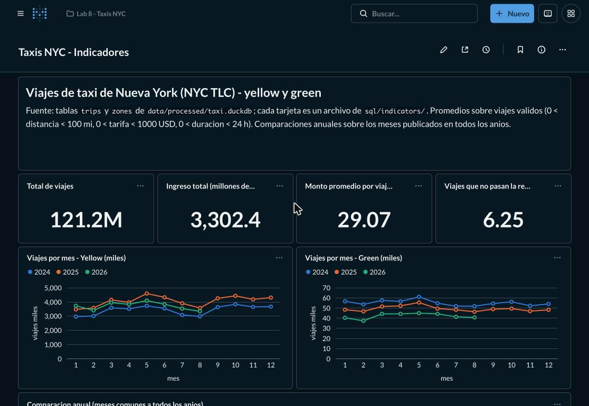
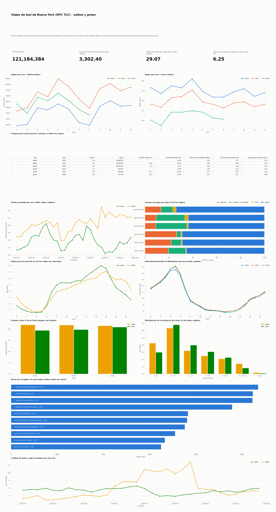

# Indicadores y tablero

Este documento explica el tablero que se construyó para entender los viajes de
taxi de Nueva York. Usa los datos de los taxis amarillos (yellow) y verdes
(green) que publica la NYC TLC, la oficina que regula los taxis de la ciudad,
para 2024, 2025 y los meses de 2026 que ya están publicados (enero a agosto).

Un indicador es un número o una gráfica que responde una pregunta concreta, por
ejemplo cuántos viajes hubo cada mes o cuánto paga en promedio un pasajero. Aquí
hay 15, numerados de P1 a P15. Todos se calculan con DuckDB, que es un motor de
base de datos que corre dentro de nuestro propio programa, sin necesidad de un
servidor aparte. Las consultas se hacen sobre la tabla `trips`, que tiene un
registro por cada viaje, y sobre la tabla `zones`, que traduce el número de cada
zona de la ciudad a su nombre. Las dos están en el archivo
`data/processed/taxi.duckdb`.

Cada indicador tiene su propio archivo SQL en
[`sql/indicators/`](../sql/indicators/). Al inicio de cada archivo hay unos
comentarios que dicen qué pregunta responde, cómo se calcula y con qué tipo de
gráfica se muestra. Así el cálculo y su explicación están en el mismo lugar. Los
indicadores se ven en Metabase, que es la herramienta para tableros que trae el
ambiente del laboratorio, y también en una imagen fija,
[`dashboard/tablero.png`](dashboard/tablero.png). Los resultados de cada consulta
se guardan como archivos CSV en [`dashboard/resultados/`](dashboard/resultados/)
cada vez que se ejecuta `scripts/indicators.py`.

## Cómo se generan

Con el ambiente levantado, estos cuatro comandos crean la base, calculan los
indicadores, dibujan la imagen fija y arman el tablero en Metabase.

```bash
docker compose exec lab python scripts/create_database.py    # tabla trips + zones
docker compose exec lab python scripts/indicators.py         # ejecuta los 15 SQL -> docs/dashboard/resultados/
docker compose exec lab python scripts/render_dashboard.py   # imagen -> docs/dashboard/tablero.png
docker compose exec lab python scripts/setup_dashboard.py    # tablero en Metabase (http://localhost:3000)
```

El último script habla directamente con Metabase y hace todo lo que normalmente
se haría a mano con clics. Si Metabase todavía no tiene usuario administrador, lo
crea con el correo y la contraseña de las variables `MB_ADMIN_EMAIL` y
`MB_ADMIN_PASSWORD`. Después conecta Metabase al archivo `taxi.duckdb` en modo
de solo lectura, para que Metabase pueda leer los datos pero nunca cambiarlos.
Luego crea una pregunta de Metabase por cada archivo de `sql/indicators/`, las
guarda en la colección `Lab 8 - Taxis NYC` y las acomoda en el tablero
`Taxis NYC - Indicadores` en la posición que dice cada archivo. Se puede correr
las veces que se quiera, porque si las preguntas ya existen las actualiza en
lugar de crear copias. Para usar un correo y una contraseña propios se corre así.

```bash
docker compose exec -e MB_ADMIN_EMAIL=usuario@ejemplo.com -e MB_ADMIN_PASSWORD='...' \
    lab python scripts/setup_dashboard.py
```

Si se vuelve a crear `taxi.duckdb` mientras Metabase está abierto, Metabase
sigue leyendo el archivo viejo. Para que tome el nuevo hay que usar la opción
"Sync database schema now" en la configuración de la base dentro de Metabase, o
reiniciarlo con `docker compose restart metabase`.

## Cómo está organizado el tablero

```text
+--------------------------------------------------------------------------+
| Encabezado (fuente de los datos, viaje válido, meses comunes)            |
+------------------+------------------+------------------+------------------+
| P1 total viajes  | P2 ingreso total | P3 monto prom.   | P4 % inválidos   |   números clave
+------------------+------------------+------------------+------------------+
| P5 viajes/mes yellow (línea por año) | P6 viajes/mes green (línea por año)  |   evolución en el tiempo
+--------------------------------------+--------------------------------------+
| P7 comparación anual (tabla, meses comunes)                                 |   comparación por año
+--------------------------------------+--------------------------------------+
| P8 tarifa mensual (yellow vs green)  | P9 formas de pago (barras al 100 %)  |   precio y pago
+--------------------------------------+--------------------------------------+
| P10 viajes por hora (yellow vs green)| P11 velocidad en Manhattan por hora  |   el día a día
+--------------------------------------+--------------------------------------+
| P12 propina con tarjeta              | P13 distancia de los viajes          |   cómo se reparten
+--------------------------------------+--------------------------------------+
| P14 las 10 zonas con más recogidas (barras horizontales, ancho completo)   |   dónde
+--------------------------------------+--------------------------------------+
| P15 calidad de los datos (% de viajes inválidos por mes)                    |   control
+--------------------------------------------------------------------------+
```

El tablero se lee de arriba hacia abajo, de lo más general a lo más
particular. Arriba están los números grandes que dicen cuánto. Después viene
cuándo pasan los viajes, cuánto cuestan, cómo se pagan y de dónde salen. Al
final está el control de calidad, porque si los datos de un periodo tienen
problemas, eso cambia la forma de leer todas las demás gráficas.

Los colores son siempre los mismos en todas las tarjetas. Yellow es amarillo
(`#eda100`) y green es verde (`#008300`), igual que el color de cada taxi. Los
años 2024, 2025 y 2026 son azul, naranja y verde agua, en ese orden. Se revisó
que estos colores se puedan distinguir también si se tiene daltonismo. El
amarillo se ve con poco contraste sobre un fondo claro, y por eso todas las
tarjetas tienen leyenda y en Metabase cada una se puede ver también como tabla.

En el encabezado aparecen dos ideas que se usan en casi todo el tablero. La
primera es el viaje válido. Los datos traen errores, como viajes de cientos de
miles de millas o tarifas negativas, que arruinarían cualquier promedio. Por eso
los promedios solo usan los viajes con distancia entre 0 y 100 millas, tarifa
entre 0 y 1,000 dólares y duración entre 0 y 24 horas. La segunda idea son los
meses comunes. Como 2026 todavía no termina, comparar el año completo de 2025 con
ocho meses de 2026 no sería justo. Entonces las comparaciones entre años usan
solo los meses que existen en los tres años, que hoy son enero a agosto.

### Evidencia del tablero

El tablero en Metabase se llama `Taxis NYC - Indicadores` y se creó con
`scripts/setup_dashboard.py`. La exportación completa en PDF está en
[`dashboard/metabase_tablero.pdf`](dashboard/metabase_tablero.pdf), y estas son
las capturas de pantalla.

| Captura | Qué se ve |
| --- | --- |
| [`metabase_1.png`](dashboard/metabase_1.png) | Encabezado, los cuatro números clave (P1 a P4) y los viajes por mes (P5 y P6) |
| [`metabase_2.png`](dashboard/metabase_2.png) | Comparación anual (P7), tarifa por mes (P8) y formas de pago (P9) |
| [`metabase_3.png`](dashboard/metabase_3.png) | Viajes por hora (P10) y velocidad en Manhattan (P11) |
| [`metabase_4.png`](dashboard/metabase_4.png) | Propina (P12), distancia (P13) y las 10 zonas con más recogidas (P14) |
| [`metabase_7.png`](dashboard/metabase_7.png) | Calidad de los datos por mes (P15) |
| [`metabase_5.png`](dashboard/metabase_5.png) | La pregunta P7 abierta en el editor de SQL de Metabase, donde se ve que el indicador es la misma consulta de `sql/indicators/07_comparacion_anual.sql` |
| [`metabase_6.png`](dashboard/metabase_6.png) | La conexión de Metabase al archivo `/workspace/data/processed/taxi.duckdb` en modo de solo lectura |



Esta es la versión en imagen fija. La genera `scripts/render_dashboard.py` a
partir de DuckDB, con las mismas consultas y la misma posición de cada tarjeta.



## Los indicadores

### P1. ¿Cuántos viajes hay en total?

Archivo `01_total_viajes.sql`. Cuenta todas las filas de la tabla `trips`, o sea,
todos los viajes registrados, incluidos los que tienen errores. Se muestra como un
número grande.

Se eligió porque da una idea del tamaño de lo que se está analizando y porque
muchos otros indicadores son porcentajes de este total. El resultado es de
121,184,384 viajes, de los cuales 119.6 millones son yellow y 1.6 millones son
green. Con tantos registros, cargar todo en la memoria con una herramienta como
Pandas ya no es práctico (se explica en `docs/discusion.md`), pero DuckDB los
cuenta en milésimas de segundo.

### P2. ¿Cuánto dinero mueven los viajes?

Archivo `02_ingreso_total.sql`. Suma lo que pagaron los pasajeros en total
(`total_amount`, que incluye tarifa, recargos, peajes y propina) y lo muestra en
millones de dólares.

Mide el tamaño económico del servicio. Solo cuenta los viajes válidos, porque los
reembolsos aparecen como montos negativos y algunos errores de captura llegan a
863 mil dólares en un solo viaje. Si se sumaran, el total no tendría sentido. El
resultado es de 3,302.4 millones de dólares en 32 meses.

### P3. ¿Cuánto paga en promedio un pasajero?

Archivo `03_ticket_promedio.sql`. Es el promedio de lo que se pagó por viaje
válido, sumando la tarifa, los recargos, los peajes y la propina.

Se eligió porque resume lo que de verdad le cuesta un viaje a un pasajero. El
resultado es de 29.07 dólares por viaje. La tarifa sola es de unos 20 dólares,
entonces los recargos, peajes y propinas suman cerca de un tercio de lo que se
paga.

### P4. ¿Qué parte de los registros no sirve para calcular promedios?

Archivo `04_pct_invalidos.sql`. Es el porcentaje de viajes que no cumplen la regla
de viaje válido.

Sirve para saber cuánto se está dejando fuera en los promedios. Si este número
fuera muy alto, los promedios ya no representarían bien a los viajes. El
resultado es 6.25 % de los viajes.

### P5 y P6. ¿Cómo cambia la cantidad de viajes mes a mes?

Archivos `05_viajes_mensuales_yellow.sql` y `06_viajes_mensuales_green.sql`.
Cuentan los viajes de cada mes, en miles, y dibujan una línea por año encima de
los mismos meses del 1 al 12.

Poner los años uno encima del otro permite separar dos cosas. Lo que se repite
cada año en los mismos meses es la temporada. Lo que cambia de un año a otro, que
se ve como una línea más arriba o más abajo, es la tendencia. Yellow y green van
en gráficas separadas porque green tiene apenas el 1 % de los viajes de yellow. En
una misma gráfica la línea de green quedaría pegada al cero y no se vería nada.

La temporada se repite igual en los tres años. Marzo, mayo y octubre son meses
fuertes, y enero, febrero, julio y agosto son más flojos. En yellow, la línea de
2025 está por encima de las otras dos todo el año y la de 2026 queda en medio,
así que 2025 fue el año con más viajes. En green las tres líneas están ordenadas
de mayor a menor. Cada año tiene menos viajes que el anterior en todos los meses.

### P7. ¿Cómo cambian los números de un año a otro?

Archivo `07_comparacion_anual.sql`. Es una tabla con una fila por tipo de taxi y
año. Muestra los viajes y cuánto cambiaron respecto al año anterior, la tarifa
promedio, la distancia promedio, la duración promedio y la propina con tarjeta
como porcentaje de la tarifa.

Se muestra como tabla porque son datos de distinto tipo que se comparan fila por
fila. Es la comparación justa entre años del tablero, porque solo usa los meses
comunes. La consulta calcula cuáles son esos meses mirando los datos, sin
escribir un mes fijo, para que siga sirviendo cuando la TLC publique más meses de
2026.

| Tipo | Año | Viajes (ene-ago) | Cambio | Tarifa USD | Distancia mi | Duración min | Propina % |
| --- | ---: | ---: | ---: | ---: | ---: | ---: | ---: |
| yellow | 2024 | 26,388,179 | | 19.54 | 3.42 | 17.1 | 22.0 |
| yellow | 2025 | 31,556,438 | +19.6 % | 19.58 | 3.45 | 16.9 | 22.2 |
| yellow | 2026 | 29,703,355 | -5.9 % | 21.30 | 3.52 | 17.9 | 21.5 |
| green | 2024 | 443,415 | | 17.88 | 2.93 | 19.2 | 19.5 |
| green | 2025 | 397,918 | -10.3 % | 18.02 | 3.11 | 21.3 | 19.6 |
| green | 2026 | 337,114 | -15.3 % | 17.16 | 3.31 | 21.1 | 20.9 |

Yellow crece mucho en 2025 y baja en 2026, cuando su tarifa promedio sube 8.8 %.
Green pierde viajes cada año, y al mismo tiempo sus viajes se hacen más largos
(de 2.93 a 3.31 millas) y su tarifa promedio baja.

### P8. ¿Cómo cambia el precio con el tiempo?

Archivo `08_tarifa_mensual.sql`. Es la tarifa promedio de cada mes (sin propina
ni recargos) para yellow y green, en una línea continua desde enero de 2024 hasta
agosto de 2026.

El precio es la medida económica más directa, y verlo mes a mes permite ubicar en
qué momento exacto cambia algo. Las dos líneas comparten la misma escala porque
las dos están en dólares.

La tarifa de yellow sube y baja con la temporada, más baja en enero y más alta a
finales del verano, y se mueve entre 18 y 21 dólares hasta noviembre de 2025. En
diciembre de 2025 salta a 22.5 dólares y durante 2026 se queda entre 21 y 22.
Green sigue la misma temporada pero siempre por debajo de yellow, y en 2026 llega
a su nivel más bajo, entre 16.2 y 18.4 dólares.

### P9. ¿Cómo pagan los pasajeros?

Archivo `09_mezcla_pagos.sql`. Muestra qué porcentaje de los viajes se pagó con
tarjeta, en efectivo, con tarifa flexible o sin forma de pago anotada, y de otras
formas, para cada tipo de taxi y año. Se dibuja con barras que siempre llegan al
100 %, divididas en partes, porque lo que interesa es cómo se reparte el total.

Se eligió porque la forma de pago es la variable de pago que más cambió entre
años, y porque afecta lo que se ve en las propinas. Las propinas en efectivo no
quedan anotadas en los datos.

La tarjeta es la forma de pago principal, entre 64 % y 74 % de los viajes. Pero la
categoría de tarifa flexible o pago no anotado crece mucho. En yellow pasa de
9.9 % en 2024 a 23.8 % en 2025 y 26.0 % en 2026, y en green de 3.7 % a 8.4 % y
14.5 %. Ese crecimiento le quita espacio a la tarjeta y al efectivo. Green usa
mucho más efectivo que yellow, entre 19.5 % y 26.5 % de sus viajes contra 9 % a
13.5 % en yellow.

### P10. ¿A qué horas hay más viajes?

Archivo `10_actividad_por_hora.sql`. Muestra qué porcentaje de los viajes de cada
tipo empieza en cada hora del día. Se usan porcentajes para poder comparar en una
misma gráfica dos servicios de tamaños muy distintos.

Sirve para ver las horas pico y para entender cómo usa la gente cada servicio.
Los dos tienen su punto más bajo entre las 3 y las 5 de la mañana. Green llega a
su punto más alto a las 5 de la tarde (8.0 % de sus viajes) y yellow a las 6 de la
tarde (7.1 %). Green tiene más viajes en horario de trabajo, de 7 de la mañana a 6
de la tarde. Yellow tiene muchos más viajes de noche, entre las 9 de la noche y la
1 de la mañana, lo que tiene sentido para un servicio que se mueve sobre todo en
Manhattan y en los aeropuertos.

### P11. ¿Cambió la velocidad de los taxis dentro de Manhattan?

Archivo `11_velocidad_manhattan.sql`. Calcula la velocidad promedio, en millas
por hora, de los viajes yellow válidos que empiezan y terminan en Manhattan, para
cada hora del día y cada año. Usa la tabla `zones` para saber qué zonas son de
Manhattan.

La velocidad es una forma indirecta de medir el tráfico. Se eligió porque desde el
5 de enero de 2025 Nueva York cobra un peaje para entrar al sur de Manhattan, con
la idea de reducir el tráfico, y los datos de la TLC registran ese cobro desde
enero de 2025 en la columna `cbd_congestion_fee`.

La curva del día es casi igual en los tres años. A las 5 de la mañana los taxis
van a unas 15 millas por hora y entre las 11 de la mañana y las 5 de la tarde
bajan a unas 8. El promedio entre las 7 de la mañana y las 7 de la noche es de
8.62, 8.68 y 8.57 millas por hora en 2024, 2025 y 2026. Con esta medida general
no se ve que el peaje haya cambiado la velocidad de los taxis.

### P12. ¿Dejan los pasajeros más o menos propina?

Archivo `12_propina_tarjeta.sql`. Divide el total de propinas entre el total de
tarifas, solo para los viajes pagados con tarjeta. Se muestra con barras por año y
tipo de taxi.

Se limita a la tarjeta porque las propinas en efectivo no quedan anotadas. Si se
usaran todos los viajes, el cambio en las formas de pago de P9 bajaría la propina
promedio aunque los pasajeros siguieran dejando lo mismo.

La propina se mantiene muy estable. En yellow es 21.9 %, 21.9 % y 21.5 % de la
tarifa, y en green 19.5 %, 19.8 % y 20.9 %. La baja en la propina promedio de
todos los viajes que aparece en el análisis exploratorio se explica por el cambio
en las formas de pago, porque con tarjeta la propina casi no se movió.

### P13. ¿Qué tan largos son los viajes?

Archivo `13_distribucion_distancia.sql`. Reparte los viajes válidos en rangos de
distancia (de 0 a 1 milla, de 1 a 2, y así) y muestra qué porcentaje cae en cada
rango, para yellow y green.

El promedio dice que un viaje mide unas 3.5 millas, pero esconde que la mayoría de
los viajes son muy cortos y que unos pocos viajes largos suben el promedio. Esta
gráfica muestra la forma completa.

El 53 % de los viajes yellow mide menos de 2 millas, y el 21 % menos de 1 milla.
Green tiene menos viajes muy cortos (15 %) y más viajes de entre 1 y 5 millas.
Yellow tiene casi el doble de viajes de 10 a 20 millas que green (7.1 % contra
4.1 %), que son en su mayoría viajes a los aeropuertos.

### P14. ¿De dónde salen los viajes?

Archivo `14_top_zonas.sql`. Muestra las 10 zonas de la ciudad donde más pasajeros
suben a un taxi, con el nombre de la zona y su distrito. Se usan barras
horizontales porque los nombres de las zonas son largos. Necesita el catálogo de
zonas que `scripts/download_data.py` descarga junto con los viajes.

Ocho de las diez zonas están en Manhattan, como Upper East Side, Midtown, Penn
Station y Times Square. Las otras dos son los aeropuertos. JFK está en segundo
lugar con 5.2 millones de recogidas y LaGuardia en el noveno.

### P15. ¿La calidad de los datos es la misma todo el tiempo?

Archivo `15_calidad_mensual.sql`. Muestra, mes a mes, qué porcentaje de los
viajes no cumple la regla de viaje válido, para yellow y green.

Si este porcentaje sube de golpe, casi siempre significa que algo cambió en la
forma de anotar los datos, por ejemplo una empresa nueva que registra mal los
viajes. Vigilarlo evita sacar conclusiones equivocadas del resto del tablero.

Green se mueve en un rango estrecho, entre 3.8 % y 6.5 %. Yellow sube de cerca de
3.5 % en 2024 a entre 6 % y 13 % durante 2025, y baja a cerca de 5 % en 2026. Ese
salto coincide con dos problemas que se explican en
[`data_quality.md`](data_quality.md). Uno es que la empresa con `vendor_id` 7
anota todos sus viajes con duración cero. El otro es que la empresa con
`vendor_id` 2 anotó muchas tarifas negativas con un total positivo, algo que deja
de pasar en diciembre de 2025.

## Lo más importante que muestra el tablero

1. 2025 fue el año con más viajes yellow, 19.6 % más que 2024, y en 2026 bajaron
   5.9 %. Green, en cambio, pierde viajes cada año (10.3 % y 15.3 % menos).
2. El precio de yellow subió a partir de diciembre de 2025. En los mismos meses,
   la tarifa promedio de 2026 es 8.8 % más alta.
3. La forma de pagar cambió, pero la propina no. El pago flexible o sin anotar
   pasó de 10 % a 26 % de los viajes yellow, y la propina con tarjeta se quedó en
   cerca de 22 % de la tarifa.
4. Yellow y green se usan de forma distinta. Yellow tiene más viajes de noche y se
   concentra en Manhattan y los aeropuertos. Green tiene más viajes de día, de
   distancia media y con más pagos en efectivo.
5. El peaje de congestión no se nota en la velocidad promedio de los taxis dentro
   de Manhattan.
6. La calidad de los datos cambia según la empresa que los registra, y el
   indicador P15 ayuda a darse cuenta antes de leer los demás.
